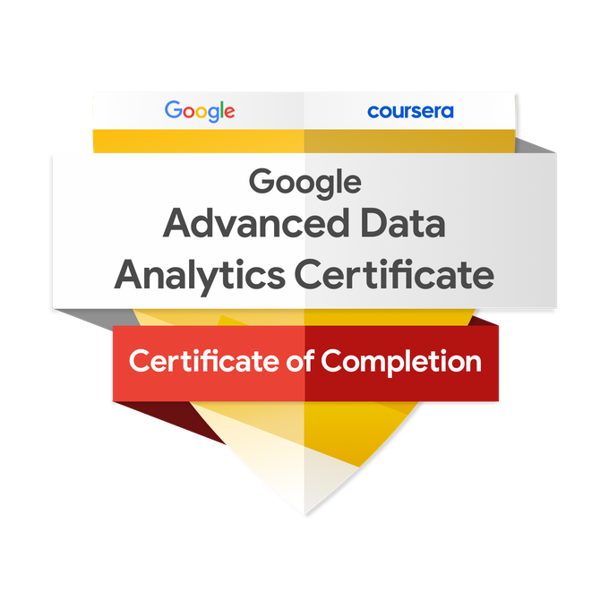

# Google Advanced Data Analytics Capstone Project



This repository contains the final capstone project for the **Google Advanced Data Analytics Professional Certificate**. The project follows the PACE framework (Plan, Analyze, Construct, Execute) to solve a real-world business challenge using a complete data analytics pipeline.

---

## 🌀 PACE Framework Overview

### 🔹 Plan
- `docs/project_proposal.md`: Problem statement, stakeholder analysis, and objectives  
- `docs/executive_summary_plan.md`: Business understanding and goals  

### 🔹 Analyze
- `notebooks/1_data_cleaning.ipynb`: Data preprocessing and cleaning  
- `notebooks/2_exploratory_analysis.ipynb`: EDA and statistical insights  
- `notebooks/3_feature_engineering.ipynb`: Transformation and feature selection  

### 🔹 Construct
- `notebooks/4_model_building.ipynb`: Machine learning model development  
- `models/`: Saved model files (e.g., `.pkl`, `.joblib`) and training logs  
- `docs/model_report.md`: Evaluation metrics and model selection rationale  

### 🔹 Execute
- `docs/executive_summary_final.md`: Final presentation of findings and recommendations  
- `notebooks/5_final_dashboard_or_visuals.ipynb`: Visualizations and key insights  
- `docs/business_recommendation.md`: Actionable recommendations for stakeholders  

---

## 🗂️ Project Structure

```
Google_Advanced_Data_Analytics_Capstone_Project/
│
├── data/ # Raw and cleaned datasets
│ ├── raw/
│ └── processed/
│
├── docs/ # Project proposal, summaries, reports
│
├── notebooks/ # Jupyter Notebooks for analysis
│
├── models/ # Trained models and logs
│
├── images/ # Visuals and certificate
│ └── certificate.png
│
├── README.md # This file
└── requirements.txt # Python dependencies
```

---

## 🧠 Key Tools and Libraries

- Python, pandas, NumPy, matplotlib, seaborn  
- scikit-learn, XGBoost  
- Jupyter Notebooks  
- Markdown for documentation

---

## 📈 Objective

Apply advanced data analytics techniques to extract insights, build predictive models, and support data-driven decision-making in a business context.

---

## 🏁 Outcome

The capstone demonstrates proficiency in the full data analysis lifecycle, from business problem framing to model execution and stakeholder communication.

---

## 🗂️ Project Structure

